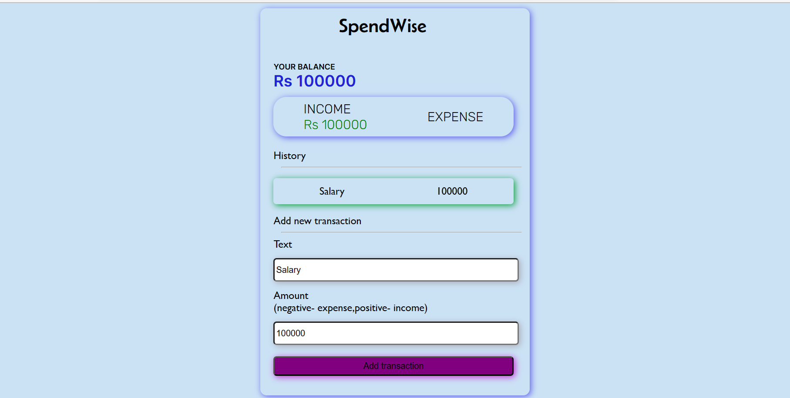

Key Features:

<ul><li>Expense Tracking and Income Management: Spendwise efficiently tracks users' expenses and income, allowing them to input and categorize their financial transactions. By providing a clear overview of both expenses and income, users can easily understand their financial situation.</li>
<li>Real-Time Balance Calculation: The app calculates and updates the total balance in real-time by subtracting the total expenses from the total income. This feature enables users to have an accurate and instant understanding of their available funds.</li>
<li>User-Friendly Interface: Spendwise offers a user-friendly interface that simplifies the process of entering expenses and income. The intuitive design ensures smooth navigation and a seamless user experience, making financial management hassle-free.</li>
</ul>

<a href="https://hershyz-spendwise.netlify.app">Try Now🚀</a>